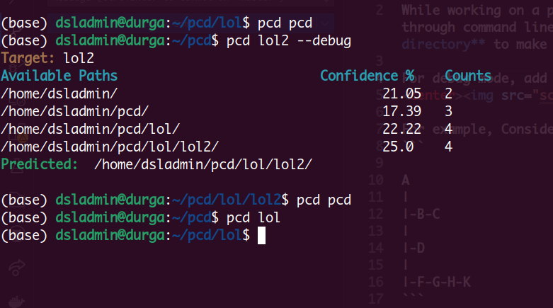

# Predictive chdir
While working on a project, frequent accessing parent and child folders through command line can become cumbersome, trying **predictive change directory** to make it simple.

For debug mode, add --debug.
<center></center>

For example, Considering a directory :-
```

A
|
|-B-C
|
|-D
|
|-F-G-H-K
```
Command required to change directory from G to A and to change directory from A to K,
```bash
cd ../../
cd F/G/H/K
```

**Using predictive cd after path logged,**
```bash
pcd A
pcd K
```

To Clear Pstore, 
```bash
p_clear
```
## Setup
Install prerequisites,
```bash
pip install -r requirements.txt
```
### For temporarily,
```bash 
chmod +x pcd
export PATH="$PATH:/path/to/pcd/script"
```

### For permanent, add at the end of bashrc file
```bash
nano ~/.bashrc
export PCD="/path/to/pcd/script"
```

## About
1. Based on Fuzzy matching uses python-levenshtein.
2. Uses path visited frequency to reduce predicting path with same name.

